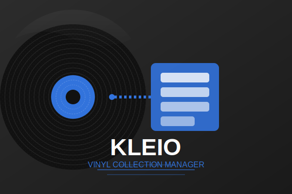
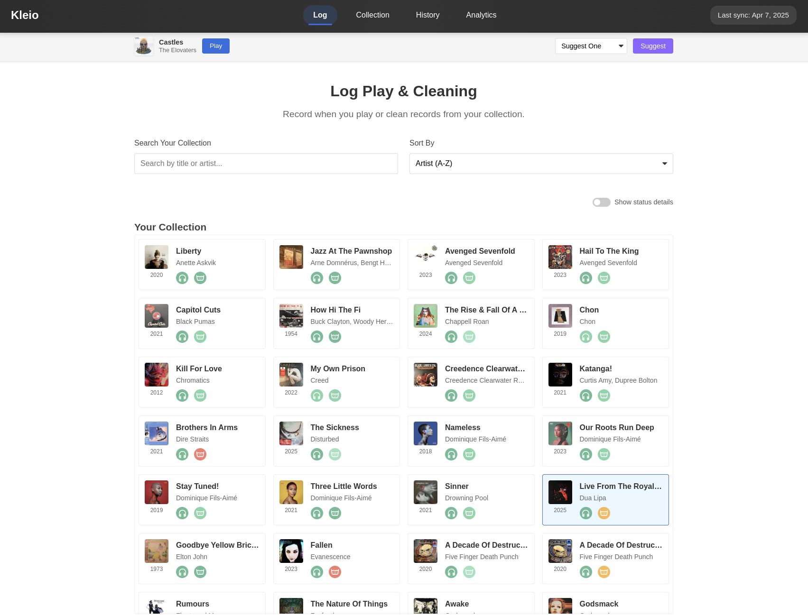
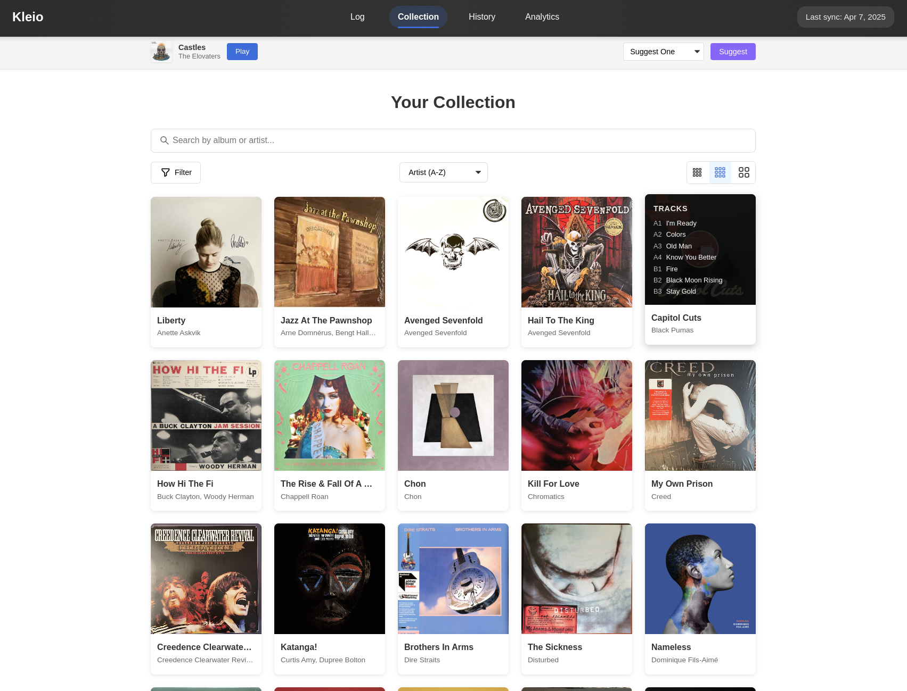
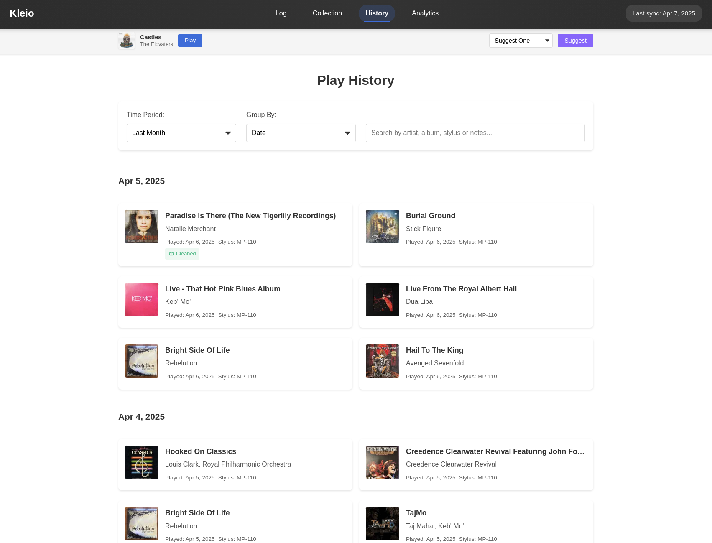
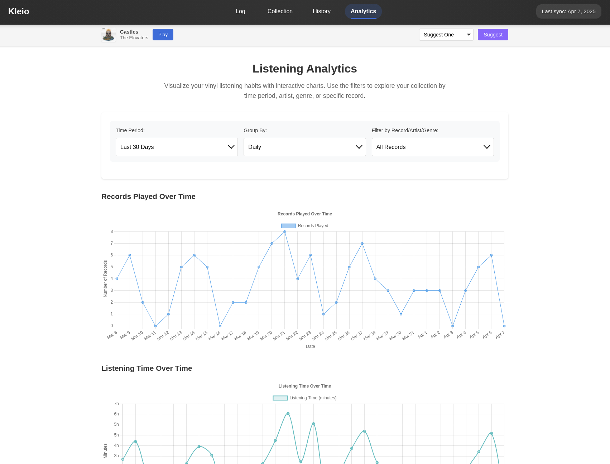

# Kleio - Vinyl Record Collection Manager



Kleio is a self-hosted vinyl record collection manager that seamlessly integrates with your Discogs account to provide enhanced tracking of your vinyl collection, plays, and cleaning history.

## Features

- **Discogs Integration**: Synchronizes with your Discogs account to import your vinyl collection
- **Play Tracking**: Log when you play your records, which stylus was used, and add notes
- **Cleaning Tracking**: Keep track of when you clean your records
- **Stylus Management**: Manage your stylus including tracking wear and estimating remaining lifespan
- **Analytics**: View insights about your listening habits with interactive charts
- **Collection Browser**: Browse and search your collection with cover art
- **Responsive Design**: Works on desktop and mobile devices

## Images






## Getting Started

### Docker (Recommended)

The easiest way to get started with Kleio is using Docker:

```bash
# Pull the latest image
docker pull deadstyle/kleio

# Run with automatic restart and persistent storage
docker run -d --restart unless-stopped -p 38080:38080 -v kleio_data:/data/db --name kleio deadstyle/kleio
```

Then visit `http://localhost:38080` in your browser.

### Docker Compose

Alternatively, you can use Docker Compose:

1. Create a `docker-compose.yml` file:

```yaml
services:
  app:
    image: deadstyle/kleio:latest
    ports:
      - "38080:38080"
    environment:
      - APP_ENV=production
      - APP_PORT=38080
    volumes:
      - kleio_data:/data/db
    restart: unless-stopped
volumes:
  kleio_data:
    driver: local
```

2. Run with Docker Compose:

```bash
docker-compose up -d
```

### Manual Build

If you prefer to build from source:

1. Clone the repository:

```bash
git clone https://github.com/bparsons0904/kleio.git
cd kleio
```

2. Build the frontend:

```bash
cd clio
npm install
npm run build
cd ..
```

3. Build the backend:

```bash
go mod download
go build -o kleio cmd/api/main.go
```

4. Run the application:

```bash
./kleio
```

## Configuration

### Discogs Integration

Kleio requires a Discogs API token to access your collection:

1. Go to your [Discogs Developer Settings](https://www.discogs.com/settings/developers)
2. Generate a personal access token
3. Enter this token in the Kleio interface when prompted

## Usage

### Recording Plays

1. Navigate to the "Log" section
2. Select a record from your collection
3. Choose which stylus was used (optional)
4. Add notes (optional)
5. Click "Log Play"

### Recording Cleaning

1. Navigate to the "Log" section
2. Select a record from your collection
3. Add notes (optional)
4. Click "Log Cleaning"

### Managing Stylus

1. Navigate to the "Equipment" section
2. Add or edit your stylus
3. Track usage and expected lifespan

### Viewing Analytics

1. Navigate to the "Analytics" section
2. View play frequency, duration, and genre distribution charts
3. Filter by various time periods

## Tech Stack

- **Backend**: Go with SQLite database
- **Frontend**: SolidJS with SCSS
- **Containerization**: Docker

## Contributing

Contributions are welcome! Please feel free to submit a Pull Request.

## License

This project is licensed under the MIT License - see the [LICENSE](LICENSE) file for details.

## Acknowledgements

- [Discogs API](https://www.discogs.com/developers) for providing access to collection data
- [SolidJS](https://www.solidjs.com/) for the reactive UI framework
- [Chart.js](https://www.chartjs.org/) for beautiful analytics visualizations
